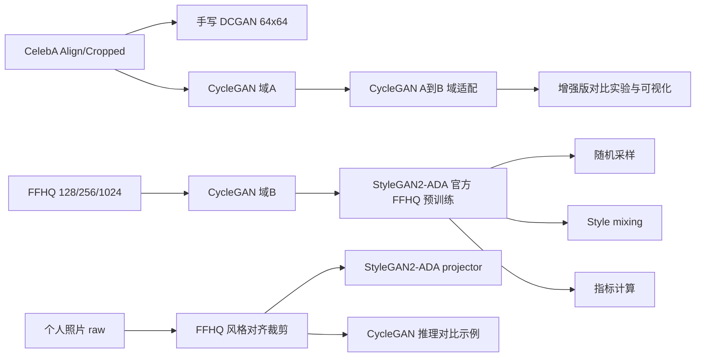
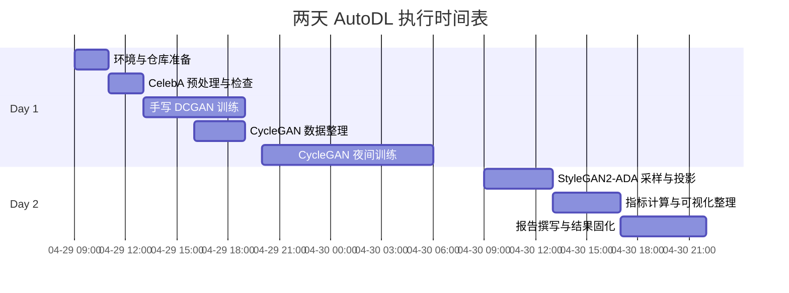

# 将 CycleGAN 接入 GAN 真实人像生成课程项目的可复现方案

## 执行摘要

按照 entity["people","李宏毅","ntu ml lecturer"] 的课程页面，你当前接受的课程范围已经明确覆盖了 GAN Basic、Theory of GAN and WGAN、Evaluation of GAN / Conditional GAN，以及 CycleGAN；因此，把“手写 DCGAN baseline + 复现 StyleGAN SOTA + 增加 CycleGAN 模块”设计成一条连续的学习路径，是与课程语境高度一致的。citeturn2view4turn1search0

这次检索的关键结论是：**如果你的要求是“一个仓库同时满足手写 baseline、SOTA 人像生成、自拍投影、CycleGAN 人像域预训练，而且两天内几乎零改动跑通”，那么未找到完美匹配的开源库。** 目前最稳妥、最官方、最可复现的组合，是基于 entity["organization","PyTorch","deep learning framework"] 官方 DCGAN 教程/示例、entity["organization","NVIDIA Research","ai research lab"] 的 `stylegan2-ada-pytorch` 官方仓库，以及 Jun-Yan Zhu 团队的 `pytorch-CycleGAN-and-pix2pix` 官方仓库来拼接一个完整工程。之所以这样选，是因为 StyleGAN2-ADA 官方仓库直接提供了预训练网络、`generate.py`、`style_mixing.py`、`projector.py`、`calc_metrics.py` 等开箱工具；而 CycleGAN 官方仓库虽然提供完整训练/测试脚本和若干预训练模型下载脚本，但官方列出的现成模型并不包含**人脸专用域**，所以人像域的 CycleGAN 部分需要你基于官方脚本自行训练。citeturn2view0turn12view0turn4view0turn4view3

在 SOTA 选型上，我建议**主线选 StyleGAN2-ADA，StyleGAN3 仅作为可选附录比较**。原因不是 StyleGAN3 不够强，而是你的作业包含“上传自拍做投影/重建展示”这一环；StyleGAN2-ADA 的官方 README 直接给出 `projector.py` 工作流，而 StyleGAN3 的官方 README 主线是 `gen_images.py`、`gen_video.py`、`train.py`、`calc_metrics.py` 与预训练 pkl，更适合做生成、训练和指标评估，不是本次两天作业里最省时间的自拍演示主线。citeturn2view0turn24view1turn24view0

因此，本报告的最终建议是：**主任务做“真实人像生成 + 自拍投影展示”，CycleGAN 作为“域适配/风格迁移辅助模块”接入同一 pipeline**。CycleGAN 的主推荐接法不是把项目改写成艺术风格迁移作业，而是做 **CelebA → FFHQ-like** 的无配对域适配，让课程中学到的 CycleGAN 自然服务于真实人像生成主线；若该方向视觉变化过小，再启用 **photo ↔ MetFaces** 作为附录型备用实验。citeturn14view0turn2view3turn17search0turn11view0

## 核心选题与任务 Pipeline

### 方案确定

我建议把题目明确写成：**“基于 GAN 的真实人像生成与域适配：从手写 DCGAN 到 StyleGAN2-ADA，并通过 CycleGAN 进行人像域迁移辅助实验。”** 这样你既保留了课程学习痕迹，也能把现代人脸 GAN 工程能力展示出来。citeturn2view4turn2view0turn4view0

在工程上，主线应分成三层。第一层是 **DCGAN baseline**：在 CelebA 上手写一个 64×64 的卷积 GAN，完整跑通数据读取、模型定义、训练循环、采样与 checkpoint 保存。第二层是 **StyleGAN2-ADA reproduction**：直接复现官方 FFHQ 预训练模型的人像随机生成、style mixing、自拍投影和指标评估。第三层是 **CycleGAN module**：把它定义成一个“域适配器”，在真实人脸域内部做 CelebA 与 FFHQ 风格统计分布之间的 A→B / B→A 翻译，或者作为备用附录做 photo↔MetFaces 风格迁移。这样的设计既不偏离“真实人像生成”，又能让 CycleGAN 成为有贡献的附加模块，而不是孤立的支线。citeturn23search0turn2view0turn11view0turn17search0



上图对应的核心想法是：**DCGAN 负责“我会手写”、StyleGAN2-ADA 负责“我会复现现代 SOTA 工具链”、CycleGAN 负责“我能把课程中的无配对域迁移知识接到真实人像任务里”。** 这个叙事对课程作业非常友好。citeturn2view4turn2view0turn11view0

### 学术与工程价值

学术上，这个组合的价值在于它把 GAN 的三条经典线索串了起来。DCGAN 对应最基础的卷积式图像生成；StyleGAN2-ADA 对应现代高质量人脸生成与有限数据鲁棒训练；CycleGAN 对应无配对图像域迁移。对于老师而言，这不是“我找了一个现成大模型跑一下”，而是“我能从课堂基础一直走到现实可交付系统”。citeturn23search0turn2view4turn2view0turn11view0

工程上，这个组合也最符合两天期限。DCGAN 用官方教程/示例即可快速完成；StyleGAN2-ADA 用官方预训练 FFHQ 模型即可在很短时间内产出高质量样例、style mixing 和自拍投影；CycleGAN 官方仓库已经给出标准安装、数据目录组织、训练与测试脚本，虽然没有人像专用预训练，但自训一个 128 或 256 分辨率的 face-domain adapter 在 AutoDL 上是现实可行的。citeturn7search0turn2view0turn4view0turn11view0

### 数据集选型

公开数据集上，我建议只围绕 **CelebA + FFHQ** 组织主线；这样最标准，也最容易解释。CelebA 由 entity["organization","The Chinese University of Hong Kong","hong kong university"] 多媒体实验室发布，包含 202,599 张人脸图像、10,177 个身份、40 个属性标注，并且官方提供对齐裁剪图和 train/val/test 划分；Torchvision 也直接封装了 `CelebA` 数据集，适合 baseline。FFHQ 官方仓库则给出 70,000 张 1024×1024 高质量对齐人脸图、128×128 缩略图、元数据和对齐复现脚本，是 StyleGAN 生态的人脸标准参照域。citeturn14view0turn8search0turn2view3turn5view4

如果你想给 CycleGAN 做一个视觉效果更强的附录实验，`NVlabs/metfaces-dataset` 是一个非常好的备用域：它包含 1336 张 1024×1024 的艺术肖像脸部图像，并且同样是 NVIDIA 官方数据集。不过我建议它只做附录或备用，不要替代真实人像主线。citeturn17search0

下表给出本次项目最推荐的数据分工：

| 数据集 | 角色 | 推荐分辨率 | 为什么选它 | 来源 |
|---|---|---:|---|---|
| CelebA Align&Cropped / Torchvision CelebA | DCGAN baseline 主训练集；CycleGAN 域 A | 64 用于 DCGAN；128 或 256 用于 CycleGAN | 标准、公开、带属性与划分、与课程级入门实现最匹配 | 官方页与 Torchvision 文档 citeturn14view0turn8search0 |
| FFHQ | StyleGAN2-ADA 参考域、自拍投影标准、CycleGAN 域 B | 1024 用于 projector；128/256 用于 CycleGAN | 高质量、对齐裁剪、StyleGAN 官方主用人脸域 | 官方仓库与 README citeturn2view3turn5view1turn5view4 |
| MetFaces | CycleGAN 备用附录域 | 256 或 1024 | 如果 CelebA→FFHQ 视觉差异过小，可换成更明显的艺术肖像迁移 | 官方仓库 citeturn17search0 |
| 你自己的照片 | projector/demo 与可视化展示 | 1024 与 256 各保存一份 | 体现真实 demo，但不建议把少量自拍直接作为主训练集 | StyleGAN2-ADA projector 建议与 FFHQ 类似对齐 citeturn2view0 |

下面这些是建议你直接保存到一个 `repo_urls.md` 文件中的**可复制官方地址**：

```text
PyTorch DCGAN 示例：
https://github.com/pytorch/examples/tree/main/dcgan

PyTorch DCGAN 教程：
https://docs.pytorch.org/tutorials/beginner/dcgan_faces_tutorial.html

StyleGAN2-ADA 官方仓库：
https://github.com/nvlabs/stylegan2-ada-pytorch

StyleGAN3 官方仓库：
https://github.com/nvlabs/stylegan3

CycleGAN / pix2pix 官方 PyTorch 仓库：
https://github.com/junyanz/pytorch-CycleGAN-and-pix2pix

FFHQ 官方仓库：
https://github.com/nvlabs/ffhq-dataset

CelebA 官方页面：
https://mmlab.ie.cuhk.edu.hk/projects/CelebA.html

EG3D 官方仓库：
https://github.com/NVlabs/eg3d

CUT / FastCUT 官方仓库：
https://github.com/taesungp/contrastive-unpaired-translation
```

### 预处理步骤

你的数据预处理应当统一围绕“**对齐、裁剪、归一化、分辨率副本**”这四件事来做。对于 DCGAN，官方教程就是在 CelebA 上进行 64×64 训练，而且明确说明该实现默认用 64×64 的图像；因此 baseline 部分直接采用 CelebA 对齐裁剪图，缩放到 64×64，归一化到 `[-1,1]` 即可。citeturn22search0turn23search0

对于 CycleGAN，官方仓库要求把无配对数据整理成 `trainA/trainB/testA/testB` 四个目录；默认的 `--preprocess resize_and_crop` 先把图像缩放到 `load_size` 再随机裁成 `crop_size`，而且图像尺寸与 `crop_size` 都需要是 4 的倍数。官方 tips 还特别提醒，高分辨率训练时因为需要同时加载两生成器和两判别器，显存会比较吃紧，所以更适合**裁剪训练、整图测试**。因此，本项目中最稳妥的设置是 **CycleGAN 训练用 256 裁剪，测试可视化保留更大尺寸**。citeturn11view0turn20view1

对你自己的照片，最关键的是**先做 FFHQ 风格的对齐裁剪，再做投影**。StyleGAN2-ADA 官方 README 明确写了 `projector.py` 对目标图片的最佳要求是“裁剪并对齐到与 FFHQ 类似”；如果你希望对“野外自拍/手机随拍”进行更接近 FFHQ 的官方式预处理，可以直接借用 EG3D 官方仓库中的 `dataset_preprocessing/ffhq/preprocess_in_the_wild.py`。这不是让你改做 3D GAN，而是单纯借用官方的人脸裁剪与位姿预处理脚本来服务 projector/demo。citeturn2view0turn18view0

因此，推荐你把自己的原始照片整理为三份副本：`raw/` 保留原图，`aligned_1024/` 用于 projector，`aligned_256/` 用于 CycleGAN 测试或附加可视化。最终报告里只展示对齐后的版本即可。这个组织方式最利于复现实验与管理文件。citeturn2view0turn18view0

### 环境规格

这次项目不建议强行把所有代码塞进一个环境里，因为官方仓库的版本跨度确实不同。`stylegan2-ada-pytorch` 官方要求 Python 3.7、PyTorch 1.7.1、CUDA 11.0 以上；而 `pytorch-CycleGAN-and-pix2pix` 在 2025 更新里明确说已经支持 Python 3.11 与 PyTorch 2.4，并支持单机多卡 DDP。为了少踩坑，建议你在 AutoDL 上至少准备两个 Conda 环境。citeturn3view4turn10view5turn4view3

| 环境名 | 用途 | Python / PyTorch | CUDA | 备注 | 来源 |
|---|---|---|---|---|---|
| `gan_course_env` | 手写 DCGAN + CycleGAN | Python 3.11，PyTorch 2.4 | 跟随 AutoDL 现成驱动 | CycleGAN 官方 2025 更新明确支持这一代版本；DCGAN baseline 也适合放在这里 | CycleGAN 官方 README citeturn4view3turn4view0 |
| `sg2ada_env` | StyleGAN2-ADA 主线 | Python 3.7，PyTorch 1.7.1 | CUDA ≥ 11.0；若是 RTX 3090 建议 ≥11.1 | 主线 SOTA 复现、projector、style mixing、metrics | StyleGAN2-ADA 官方 README citeturn3view4turn10view5 |
| `sg3_optional_env` | StyleGAN3 附录比较 | Python 3.8，PyTorch 1.9+ | CUDA ≥ 11.1 | 仅当你还想做附录横向比较时使用 | StyleGAN3 官方 README citeturn9view0 |

如果你的 AutoDL 机器是 Linux 且有至少一张 NVIDIA GPU，并且显存在 12 GB 以上，那么它已经满足 StyleGAN2-ADA / StyleGAN3 官方给出的最低推荐条件。**但你的确切 GPU 型号目前未指定**，所以后文时间表默认按“单张 NVIDIA GPU、显存不少于 12 GB”来规划；如果你租到的是更强的卡或多卡，整体时间会更宽裕。citeturn3view4turn9view0

### 两天 AutoDL 排程

两天周期里，最重要的策略是：**不要尝试从零把 StyleGAN 训到收敛。** StyleGAN2-ADA 官方给出的 wallclock 时间表非常清晰：在 1 张 V100 上，256×256 训练到 1000 kimg 仍需约 6 小时 36 分，到 25,000 kimg 则要 6 天 21 小时；1024×1024 更是长达数十天。官方同时说明，1000 kimg 往往足够做 transfer learning，而 5000 kimg 左右已经能得到相当不错的结果。因此，本作业里 StyleGAN2-ADA 的主目标应是**预训练推理 + projector + metrics + 如有余力才做极短 transfer learning**。citeturn10view2turn10view6turn16view0turn16view4

| 时间块 | 任务 | 目标产出 |
|---|---|---|
| 第一天上午 | 建两个环境；clone 官方仓库；下载 CelebA；准备自拍原图目录 | `gan_course_env`、`sg2ada_env`、数据目录结构 |
| 第一天下午 | 手写 DCGAN；在 CelebA 64×64 上启动训练 | `src/dcgan/`、loss 曲线、`fake_samples.png` |
| 第一日夜间 | 准备 CycleGAN 的 `trainA/trainB/testA/testB`；启动 128/256 分辨率训练 | `checkpoints/.../web/index.html`、首批翻译结果 |
| 第二天上午 | 用 FFHQ 预训练模型跑 StyleGAN2-ADA 随机采样、style mixing、自拍 projector | `out/seed_*.png`、`style_mixing.png`、`proj.png`、`proj.mp4` |
| 第二天下午 | 计算 FID/KID/PR；整理 CycleGAN 测试图；做对比拼图 | 指标 json/jsonl、对比图、表格初稿 |
| 第二天晚上 | 写报告、补代码说明、跑一次最终检查清单 | 可提交压缩包、报告 PDF/Markdown |



这里还有两个很实用的官方提醒。第一，StyleGAN 的指标第一次在新数据集上计算时可能有额外的 30 分钟左右一次性开销，某些指标整体能到 1 小时，因此不要把 `calc_metrics.py` 压到最后。第二，CycleGAN 官方 tips 明确说，**loss 曲线本身在 GAN 训练里通常不够说明问题，应该定期看样例图**。这两个提醒都很适合你写进实验报告的“工程经验总结”部分。citeturn10view6turn3view6turn11view0

## 模型对比矩阵

### 官方仓库映射

先说清楚仓库级别的映射关系。你这次最应该使用的不是东拼西凑的民间仓库，而是下面这几套**官方或近官方**资源：

| 模块 | 推荐仓库 | 选它的理由 | 开箱性判断 | 关键脚本/内容 | 来源 |
|---|---|---|---|---|---|
| DCGAN baseline | `pytorch/examples` 的 `dcgan` + PyTorch 官方 tutorial | 最贴近课堂；代码短；便于手写；官方示例会定期保存 `real_samples.png` / `fake_samples.png` 与 checkpoint | 高 | `main.py`、官方 tutorial | 官方示例与教程 citeturn7search0turn22search0turn23search0 |
| SOTA 主线 | `nvlabs/stylegan2-ada-pytorch` | 有 FFHQ 预训练网络；有 `generate.py`、`style_mixing.py`、`projector.py`、`calc_metrics.py`；适合自拍 demo | 很高 | `generate.py`、`style_mixing.py`、`projector.py`、`calc_metrics.py` | 官方 README citeturn2view0turn16view1 |
| SOTA 备选 | `nvlabs/stylegan3` | 官方预训练 FFHQ pkl 与更现代指标；适合做附录对比 | 中到高 | `gen_images.py`、`gen_video.py`、`train.py`、`calc_metrics.py` | 官方 README citeturn24view1turn9view5turn3view6 |
| CycleGAN 模块 | `junyanz/pytorch-CycleGAN-and-pix2pix` | 官方 PyTorch 版；安装说明、训练/测试脚本、自定义数据目录、预处理 tips 完整 | 高，但**人像域需自训** | `train.py`、`test.py`、`scripts/download_cyclegan_model.sh` | 官方 README 与 tips citeturn4view0turn11view0turn12view0 |
| 自拍预处理 | `NVlabs/eg3d` 的 `preprocess_in_the_wild.py` | 给野外人像一个更接近 FFHQ 的官方预处理路径 | 中 | `dataset_preprocessing/ffhq/preprocess_in_the_wild.py` | 官方 README citeturn18view0 |

这里需要明确写进报告的一个事实是：**如果要求 CycleGAN 也必须“有官方现成人像预训练权重、两天内零训练接入”，那么未找到完美匹配的开源库。** 因为官方 PyTorch CycleGAN 仓库提供的预训练模型清单是 `apple2orange`、`horse2zebra`、`monet2photo`、`cityscapes_*`、`facades_*`、`iphone2dslr_flower` 等，并没有列出官方 face-domain 模型。也就是说，你能用它做“人像域的 CycleGAN”，但方式是**用官方脚本自训**，而不是下载一个现成 face checkpoint。citeturn12view0turn2view2

如果你因为时间或显存压力，不想坚持原始 CycleGAN 训练，那么最佳的官方次优替代方案是同作者团队的 **CUT/FastCUT**。他们在官方 README 中明确写到，相比 CycleGAN，CUT 训练更快、显存更省，而 FastCUT 是更轻、更快的替代品。只是从课程叙事上看，既然你已经学过 CycleGAN 基础，我仍建议把正式提交的主模块写成 CycleGAN，CUT/FastCUT 作为备用说明即可。citeturn13search0

### Baseline 与 SOTA 的最终落地建议

**基础模型（Baseline）**  
推荐你手写 **DCGAN**。实现方式不是去找第三方“脸生成 DCGAN 仓库”，而是自己写 `Generator`、`Discriminator`、`weights_init()`、`train_one_epoch()`、`sample_fixed_noise()`，并参考官方示例的输出组织方式。这样最能体现“我学了 GAN，不是只会跑仓库”。官方 DCGAN 教程正是以 CelebA 为例，而且默认 64×64，这与你的课程作业完全匹配。citeturn22search0turn23search0turn7search0

**前沿模型（SOTA）**  
推荐主线为 **StyleGAN2-ADA**，不是 StyleGAN3。原因前面已经说过：你这次的展示重点之一是自拍投影，而 StyleGAN2-ADA 官方直接给出了 projector 工作流。若你仍希望报告里体现“紧跟时代”，可以在“相关工作 / 附录”里简要加入 StyleGAN3 对比，说明它提供了更现代的 alias-free 架构、等变性指标和 FFHQ 官方权重，但本作业主线并不把它作为唯一 SOTA。citeturn2view0turn24view1turn3view6

### Baseline vs SOTA vs CycleGAN-augmented workflow

| 工作流 | 任务角色 | 推荐数据 | 你需要自己写的部分 | 两天内可行性 | 应交成果 | 风险点 |
|---|---|---|---|---|---|---|
| 手写 DCGAN | 课程 baseline | CelebA 64×64 | 高，核心网络与训练循环建议自己写 | 高 | 训练曲线、生成样本、checkpoint、代码说明 | 质量有限，容易出现模糊与模式崩塌；但正适合做 baseline | 官方教程/示例支持 CelebA 64×64 citeturn22search0turn23search0turn7search0 |
| StyleGAN2-ADA reproduction | 主 SOTA | FFHQ 预训练 + 自拍对齐图 | 低到中，主要是脚本整合与结果管理 | 很高 | 随机采样、style mixing、自拍投影、指标结果 | 不要从零训练；重点是官方预训练复现与 demo | 官方脚本齐全，projector 可直接用 citeturn2view0turn16view1turn10view6 |
| CycleGAN-augmented workflow | 域适配辅助模块 | CelebA↔FFHQ；备用 CelebA/FFHQ↔MetFaces | 中，主要是数据整理与训练脚本、可视化 | 中到高 | A→B、B→A、cycle consistency 图；可选做 baseline 增强实验 | 官方无 face-pretrained，必须自训；CelebA→FFHQ 变化可能较 subtle | 官方训练脚本与 face-domain 自训条件明确 citeturn11view0turn12view0turn17search0 |

如果把“CycleGAN 与主线如何绑定”再说得更具体一点，我建议你在最终报告里把它写成下面两个实验之一：

1. **主推荐：域适配版**  
   用 CycleGAN 把 CelebA 对齐脸翻译成更接近 FFHQ 纹理/背景/光照统计的域，形成 `CelebA_to_FFHQlike`。然后将其作为补充样例加入对比实验，展示“无配对域迁移可以让 baseline 看到一个更规整的人脸分布”。这条线最符合“真实人像生成”主任务。相关数据目录组织与预处理方式完全符合官方 CycleGAN tips。citeturn11view0turn14view0turn2view3

2. **备用：风格迁移版**  
   如果你发现 CelebA→FFHQ 的视觉变化太小，不利于答辩展示，那么就把 CycleGAN 单独改成“photo↔MetFaces” 附录实验。这样图像变化会明显得多，适合做一组漂亮的说明图，但正文里要明确它是“CycleGAN 附加实验”，不是主 benchmark。citeturn17search0

## 实验报告撰写指南

### 性能评估指标

对于 **DCGAN / StyleGAN2-ADA 主线**，建议你至少报告 **FID、KID、Precision/Recall** 三项指标；如果希望把 style-based generator 的潜空间特性写得更完整，再加 **PPL**。这些都是 StyleGAN 官方 README 明确推荐或支持的指标。StyleGAN3 甚至把 `fid50k_full`、`kid50k_full`、`pr50k3_full`、`ppl2_wend` 直接列为 recommended metrics；StyleGAN2-ADA 官方也列出了 FID、KID、PR 和 PPL 等指标及其典型耗时。citeturn3view6turn10view6

对于 **CycleGAN 模块**，我建议不要追求特别复杂的“人脸专用大一统指标”，而是采取一套更稳妥的作业型评估方法：第一，用 **translated-domain FID/KID** 评价 A→B 图像是否更靠近目标域；第二，用 **A→B→A 与 B→A→B 的可视化重建图** 展示 cycle consistency；第三，用**人工评审维度**记录身份保留、背景漂移、颜色偏移和伪影。官方 CycleGAN 仓库本身就强调训练过程中要看 web/HTML 中间结果，而不是只盯 loss 曲线，所以这种“定量 + 定性”混合评估是合理的。citeturn11view0turn4view0

### 加分项建议

最容易加分的不是“我有一个更低的 FID”，而是“我讲清楚了自己如何从课程内容一路走到工程复现”。最建议你在报告里包装成两个亮点。第一个亮点是 **从 DCGAN 到 StyleGAN2-ADA 的代际对比**：你可以系统比较生成清晰度、样本多样性、训练稳定性、指标结果和视觉可控性。第二个亮点是 **自拍进入 GAN 潜空间**：展示原图、对齐图、projector 重建图、投影视频帧，以及可选的 style mixing 结果。这两个亮点都与官方仓库直接对应，能最大限度减少“讲故事但做不出来”的风险。citeturn2view0turn16view1

如果还想再往上做一步，我建议你加一个**小型消融实验**。最推荐的三个消融方向如下。第一，**数据域消融**：DCGAN 在原始 CelebA 上训练，与在 CycleGAN 适配后的 `CelebA_to_FFHQlike` 上训练做对比。第二，**预处理消融**：自拍 raw crop 与 FFHQ-style 对齐 crop 喂给 projector 的对比。第三，**CycleGAN 分辨率消融**：128 与 256 两种训练分辨率的效果与显存占用对比。这里不需要把所有实验都做满；做成“小而完整”的 ablation 比做成“大而散”的列表更适合两天作业。citeturn2view0turn11view0turn5view4

### 报告结构与代码描述

你的实验报告建议按下面这个顺序写：**研究背景与课程关联、数据集与预处理、Baseline 设计、SOTA 复现、CycleGAN 模块设计、实验结果与消融、失败案例与讨论、伦理与数据许可、结论**。其中“课程关联”一节可以明确写明你所学范围已经覆盖了 GAN / WGAN / CycleGAN，因此本作业设计是围绕课程知识渐进展开的。citeturn2view4

代码描述部分，不建议只贴仓库链接，而要明确说明“哪些是我手写的、哪些是我调用官方脚本的、我改了哪些参数”。一个容易拿高分的写法是把代码分成五个模块：`data/`、`src/dcgan/`、`external/stylegan2-ada-pytorch/`、`external/pytorch-CycleGAN-and-pix2pix/`、`scripts/`。这样老师一眼就能看出你的工作量边界。citeturn2view0turn4view0turn7search0

最后，别忽略“伦理与许可”。CelebA 官方明确写明其数据仅限非商业研究用途；FFHQ 官方说明只收集了许可友好的 Flickr 图像，同时也提供了数据隐私/移除通道。你自己的照片则必须基于你本人授权，且在报告里说明“仅用于课程展示，不做公开传播数据集”。这是课程作业里很容易被忽略、但写出来会显得很专业的一节。citeturn14view0turn15view2

## Codex Prompt 与上传清单

下面这段 prompt 是为你在 Cursor/Codex 中直接开工准备的。它的设计目标不是让 Codex 机械照抄，而是**要求它先思考、先发现冲突、先给改进建议，再实施**。

```text
你现在是这个课程项目的首席实现工程师。请你先思考，再实施；不要机械执行。你的目标是帮助我完成一个“GAN 真实人像生成课程项目”，要求如下：

【项目目标】
1. 主线必须是 GAN-centered，不允许换成 diffusion 主线。
2. 项目必须包含三个部分：
   - 手写 DCGAN baseline（我希望体现课程学习过程）
   - StyleGAN2-ADA 官方复现主线（必要时可附带 StyleGAN3 作为可选附录）
   - 一个加入到主 pipeline 的 CycleGAN 模块（优先做 CelebA -> FFHQ-like 的域适配；如果你判断视觉变化过小，请主动提出 photo <-> MetFaces 作为附录备选）
3. 我要在 AutoDL 云端运行，算力足够，但时间只有两天。
4. 我会上传我自己的照片，用于 projector/demo；是否用于训练由你评估，但不要默认少量自拍能训练出好模型。
5. 最终要交：设计文档、实验结果、实验报告、代码说明。

【必须遵守的官方仓库】
- PyTorch DCGAN example / tutorial
- NVlabs/stylegan2-ada-pytorch
- NVlabs/stylegan3（仅可选）
- junyanz/pytorch-CycleGAN-and-pix2pix
- NVlabs/ffhq-dataset
- CelebA 官方页面
- 如需野外人像预处理，可参考 NVlabs/eg3d 的 preprocess_in_the_wild.py

【你的工作模式】
1. 第一阶段先输出“实现前审查”：
   - 检查我上传的文件是否齐全
   - 检查环境冲突（例如 StyleGAN2-ADA 的 Python 3.7/PyTorch 1.7.1 与 CycleGAN 新版环境的冲突）
   - 检查数据路径、磁盘占用、是否适合下载 FFHQ 完整图或只用缩略图
   - 检查两天内哪些实验可行、哪些只能做可选项
   - 主动提出更稳健的替代方案，但不能偏离 GAN-centered 主线
2. 第二阶段再实施：
   - 为 DCGAN 写最小但规范的手写实现
   - 创建统一的数据准备脚本
   - 创建 StyleGAN2-ADA 的生成、style mixing、projector、metrics 脚本
   - 创建 CycleGAN 的数据目录构建、训练、测试、结果导出脚本
   - 生成 README、运行命令、实验输出目录结构
3. 第三阶段输出整理：
   - 自动生成实验报告骨架
   - 自动收集关键图片到 report_assets/
   - 自动导出一个 results_summary.md
   - 自动列出“已完成/未完成/可选增强项”

【你必须主动思考与改进】
- 如果你发现 CelebA -> FFHQ-like 的 CycleGAN 视觉改变量太小，请不要死做，先给出判断依据，再切换到备用附录方案。
- 如果你发现 StyleGAN3 不适合本次两天主线，请明确说明原因，但保留可选附录目录。
- 如果你发现某个脚本或参数会导致大概率失败，请提前提出更稳妥的参数，而不是等报错。
- 如果你发现我的自拍数量不足以训练某个模块，请明确拒绝把它当主训练集，并给更合理的用法。
- 如果你发现有更好的代码组织方式，请先说明，再执行。

【输出与文件结构要求】
请把项目组织成下面这种结构；如果你认为有更好的结构，可以先解释再调整：
project/
  README.md
  repo_urls.md
  environment/
    env_dcgan_cycle.yml
    env_stylegan2ada.yml
    env_stylegan3_optional.yml
  data/
    raw/
    processed/
    manifests/
  src/
    dcgan/
  external/
    stylegan2-ada-pytorch/
    stylegan3/
    pytorch-CycleGAN-and-pix2pix/
  scripts/
    prepare_celeba.py
    prepare_ffhq.py
    prepare_personal_photos.py
    train_dcgan.py
    run_stylegan2ada_generate.sh
    run_stylegan2ada_projector.sh
    run_stylegan2ada_metrics.sh
    train_cyclegan.sh
    test_cyclegan.sh
    collect_report_assets.py
  outputs/
    dcgan/
    stylegan2ada/
    cyclegan/
  report/
    report_outline.md
    report_assets/
    results_summary.md

【你输出代码时的要求】
- 每个脚本都要有注释、参数说明、异常处理
- 不要假设我的路径固定
- 不要省略 requirements / conda 依赖
- 不要默认所有图片都适合做 projector，要保留筛选逻辑
- 任何关键决策都要写在 README 里
- 先给计划，再开始写文件
```

建议你上传给 Codex 的文件清单如下：

| 文件或目录 | 是否必传 | 作用 | 说明 |
|---|---|---|---|
| `teacher_assignment.md` | 必传 | 课程要求原文 | 让 Codex 不偏题 |
| `autodl_machine_info.txt` | 必传 | 环境审查 | 写清 GPU 型号、显存、CUDA、磁盘；目前该信息未指定 |
| `repo_urls.md` | 必传 | 锁定官方资源 | 把上文给出的官方地址直接放进去 |
| `my_photos/raw/` | 必传 | 自拍 projector/demo | 先放原图，不要手动乱裁 |
| `my_photos/selected.csv` | 建议 | 标记哪些图适合 projector | 可加字段：frontal / occlusion / glasses / blur |
| `course_scope_notes.md` | 建议 | 告诉 Codex 你学过什么 | 可以写“我已学 DCGAN、WGAN、CycleGAN basics” |
| `report_template.md` 或学校模板 | 建议 | 约束输出格式 | 让生成的报告骨架更贴合学校要求 |
| `experiment_checklist.md` | 建议 | 管理两天任务 | 列出必须完成与可选增强项 |

## 开放问题与限制

第一，**确切 GPU 型号与磁盘预算目前未指定**。因此上面的排程是基于官方最低硬件建议所做的保守规划，而不是针对某块具体卡的精确 wallclock 预测。只要你的 AutoDL 机器满足至少一张 NVIDIA GPU、显存 12 GB 以上，主线一般就能跑通；但如果显卡更强或有多卡，CycleGAN 与可选短程微调会更从容。citeturn3view4turn9view0

第二，**人像域的 CycleGAN 没有找到官方现成预训练权重**。这正是本次检索里最需要诚实说明的点。所以，如果你追求“CycleGAN 模块也要拿来即用”，答案就是前面那句：**未找到完美匹配的开源库**。最好的替代方式有两个：要么用官方 PyTorch CycleGAN 自训 CelebA↔FFHQ 或 photo↔MetFaces；要么在确实时间很紧时改用同作者团队的 CUT/FastCUT 作为更快更轻的次优替代。citeturn12view0turn13search0

第三，**StyleGAN3 适合作为附录，不适合作为本次唯一主线 SOTA**。这不是因为它不够强，而是因为你的交付里明确包含自拍投影展示，而官方 README 层面，StyleGAN2-ADA 对这一点更直接。你完全可以在报告最后写一句：本项目选择 StyleGAN2-ADA 作为主线，是为了匹配 time-to-demo；StyleGAN3 的官方复现与指标比较被保留为后续升级方向。citeturn2view0turn24view1turn24view0

基于以上所有证据，我的最终建议可以浓缩成一句话：**主线做手写 DCGAN + StyleGAN2-ADA 官方复现 + 自拍 projector，CycleGAN 作为 CelebA→FFHQ-like 域适配模块接入；若该视觉差异过小，就把 CycleGAN 附录切到 photo↔MetFaces，并在报告中诚实说明“官方无现成人像预训练，从而采用官方脚本自训”。** 这个方案最符合课程范围、最容易两天内交付，也最能体现你的学习过程与工程复现能力。citeturn2view4turn2view0turn11view0turn17search0