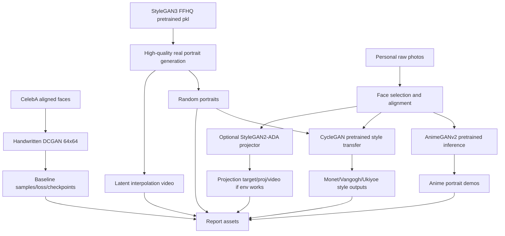

# GAN 真实人像生成大作业最终技术路线

更新时间：2026-04-30  
工作目录：`C:\GAN`  
当前定位：**真实人像生成是主任务；动漫化/风格迁移是可选增强模块**。

## 0. 最终结论

本项目应采用“主线生成 + 增强展示”的结构，而不是把所有内容混成一个任务。

**主线必须围绕真实人像生成：**

1. **手写 DCGAN baseline**：在 CelebA 64x64 上训练，体现课程学习过程与手写 GAN 能力。
2. **官方预训练 StyleGAN 系列复现**：优先使用 StyleGAN3/StyleGAN2 官方 FFHQ 预训练权重完成高质量真实人像生成；尽量不从零训练。
3. **个人照片示例**：个人照片不作为训练集，只用于推理展示：优先做动漫化/风格迁移，StyleGAN projector 作为可选增强。

**增强模块可以加入动漫化/风格迁移：**

1. **零训练优先**：使用 AnimeGANv2 预训练权重对个人照片做人像动漫化。
2. **课程关联优先**：使用 CycleGAN 官方仓库做风格迁移或域迁移；若时间紧，先使用官方已有 `style_monet/style_vangogh` 等预训练模型做快速风格迁移展示。
3. **自训仅作为加分项**：在 RTX 4090D 24GB 上可以自训 128/256 分辨率 CycleGAN，但不把它设为主线成败条件。

严格事实边界：

- 没有找到一个官方仓库能同时满足“手写 baseline + SOTA 人像生成 + 自拍投影 + 人像域 CycleGAN 预训练 + 动漫化 + 两天内零改动跑通”。
- CycleGAN 官方预训练列表没有 face/CelebA/FFHQ 人像域模型；人像域 CycleGAN 若要做，必须自训。
- StyleGAN2-ADA 的官方 projector 很适合自拍投影，但其官方环境偏旧；在 RTX 4090D/CUDA 12.8/Python 3.12 的镜像上，不能把它当作零风险主线。
- StyleGAN3 官方仓库提供 FFHQ 预训练权重，环境适配比 StyleGAN2-ADA 更现代，更适合作为本机高配下的真实人像生成主复现工具。

## 1. 已知 AutoDL 配置与工程影响

从你提供的截图，本次规划按如下配置执行：

| 项目 | 配置 |
|---|---|
| 镜像 | PyTorch 2.8.0 |
| Python | 3.12, Ubuntu 22.04 |
| CUDA | 12.8 |
| GPU | RTX 4090D 24GB x1 |
| CPU | 16 vCPU Intel Xeon Platinum 8352V |
| 内存 | 60GB |
| 磁盘 | 系统盘 30GB，数据盘免费 50GB SSD |

工程判断：

- GPU 足够跑 DCGAN、CycleGAN 128/256、AnimeGANv2 推理、StyleGAN3 预训练生成。
- 数据盘 50GB 不适合默认下载 FFHQ 1024 全量图像（约 89GB），因此主线应使用官方预训练权重，数据集只下载 CelebA、FFHQ 128 thumbnails 或小规模 FFHQ/MetFaces 子集。
- 当前镜像的 Python 3.12/PyTorch 2.8 与 StyleGAN2-ADA 官方旧环境不匹配；如果要跑 `projector.py`，建议单独环境或容器，失败时不影响主线。
- 不需要先等待更多硬件确认；后续实现直接按该高配假设推进。

## 2. 课程现状对齐

李宏毅 ML 2021 课程页的 Generative Model 部分包含 GAN Basic、Theory of GAN and WGAN、Evaluation of GAN and Conditional GAN、CycleGAN，并有 HW6 GAN。

因此项目叙事应写成：

> 我先手写基础 GAN 生成真实人像，再复现官方预训练的高质量 StyleGAN 人像生成模型，最后用 CycleGAN/AnimeGANv2 扩展到非成对风格迁移和个人照片示例。

课程对齐关系：

| 课程知识 | 对应模块 | 报告价值 |
|---|---|---|
| GAN basic | DCGAN baseline | 体现手写生成器、判别器、对抗损失 |
| GAN evaluation | FID/KID/PR、可视化对比 | 不只肉眼看图 |
| CycleGAN | 风格迁移/域迁移增强 | 呼应课堂重点 |
| 现代 GAN | StyleGAN3/StyleGAN2 权重复现 | 体现工程复现能力 |

## 3. 两份参考思路的综合判断

### 3.1 Gemini PDF 方案

Gemini 方案偏向 `Real Selfie <-> Anime/Art Portrait`，baseline 用 CycleGAN，SOTA 用 CUT/FastCUT。

可取之处：

- 非常贴合 CycleGAN 与非成对图像翻译。
- 个人照片动漫化展示强，适合报告和答辩。
- CUT/FastCUT 作为 CycleGAN 改进方向，工程成本较低。

局限：

- 如果作为主线，会偏离“真实人像生成”。
- Selfie2Anime 不是最标准的人像生成数据集。
- CUT/FastCUT 是图像翻译路线，不能替代真实人像生成器。

采纳方式：保留为**增强模块**，不作为主线。

### 3.2 GPT Markdown 方案

GPT 方案偏向 DCGAN + StyleGAN2-ADA + CycleGAN 域适配。

可取之处：

- 主线符合真实人像生成。
- CelebA 与 FFHQ 是标准公开数据集。
- StyleGAN2-ADA 有官方 FFHQ 权重、生成脚本、style mixing、projector、metrics。
- 明确承认 CycleGAN 没有官方人像域预训练。

需要修正：

- 在你当前 RTX 4090D/CUDA 12.8/Python 3.12 环境下，StyleGAN2-ADA 的旧依赖风险更高。
- 应把 StyleGAN3 升级为“高质量真实人像生成主复现候选”，把 StyleGAN2-ADA projector 降为可选增强。
- 动漫化/风格迁移应明确加入项目，但不能压过真实人像生成主线。

## 4. 最终项目结构

推荐题目：

> 基于 GAN 的真实人像生成与风格迁移扩展：从手写 DCGAN 到 StyleGAN 预训练复现

整体模块：

| 层级 | 模块 | 是否必须 | 训练依赖 | 作用 |
|---|---|---|---|---|
| 主线 A | 手写 DCGAN | 必做 | 需要训练 | 课程 baseline |
| 主线 B | StyleGAN3/StyleGAN2 官方预训练生成 | 必做 | 不从零训练 | 高质量真实人像生成 |
| 主线 C | 指标与报告 | 必做 | 需要样本统计 | 支撑实验结论 |
| 增强 D | AnimeGANv2 个人照片动漫化 | 建议做 | 不训练，使用预训练 | 强展示效果 |
| 增强 E | CycleGAN 风格迁移/域迁移 | 建议做 | 优先预训练，可选自训 | 呼应课程重点 |
| 增强 F | StyleGAN2-ADA projector | 可选 | 不训练，但环境有风险 | 自拍潜空间展示 |

## 5. 数据集与输入材料

### 5.1 主数据集

| 数据集 | 用途 | 数据规模策略 |
|---|---|---|
| CelebA Align&Cropped | DCGAN baseline | 下载标准对齐裁剪图，训练 64x64 |
| FFHQ | StyleGAN 参考域 | 优先使用官方预训练权重；只下载 128 thumbnails 或小子集 |
| 个人照片 | demo 输入 | 原图保留；对齐裁剪后用于 AnimeGANv2/CycleGAN/可选 projector |

### 5.2 增强数据集

| 数据集 | 用途 | 是否必须 |
|---|---|---|
| MetFaces | 艺术肖像风格迁移或 CycleGAN 自训 | 可选 |
| AnimeGANv2 自带预训练风格 | 动漫化推理 | 推荐 |
| Selfie2Anime | 如果坚持自训自拍动漫域转换 | 不推荐作为两天主线 |

数据边界：

- 个人照片不训练 GAN，只做推理展示。
- 不下载 FFHQ 1024 全量，除非扩容数据盘。
- 如果要做指标，优先用 CelebA/FFHQ thumbnails 或小规模一致分辨率子集。

## 6. 模型路线

### 6.1 Baseline：手写 DCGAN

| 项目 | 方案 |
|---|---|
| 模型 | DCGAN |
| 数据 | CelebA |
| 分辨率 | 64x64 |
| 框架 | PyTorch 2.8 可直接写 |
| 输出 | loss 曲线、固定噪声生成图、checkpoint |
| 报告定位 | 学习过程与基础生成能力 |

训练建议：

- 先跑 1 epoch dry-run。
- 正式跑 20-50 epoch。
- 4090D 24GB 足够，但质量不会接近 StyleGAN，这是 baseline 的合理结果。

### 6.2 主 SOTA 复现：StyleGAN3 优先

| 项目 | 方案 |
|---|---|
| 模型 | StyleGAN3 或 StyleGAN2-compatible pretrained |
| 仓库 | https://github.com/NVlabs/stylegan3 |
| 权重 | 官方 FFHQ 1024/256 pkl |
| 训练 | 不从零训练 |
| 输出 | 高质量真实人像、插值视频、FID/KID/PR 可选 |
| 为什么优先 | 官方预训练、环境相对现代、适合 RTX 4090D |

建议命令方向：

- `gen_images.py`：随机生成 FFHQ 人像。
- `gen_video.py`：潜空间插值视频。
- `calc_metrics.py`：如果数据集准备充分，再算 FID/KID/PR。

报告定位：

> StyleGAN3 是本项目的高质量真实人像生成复现主线，展示从基础 DCGAN 到现代 style-based GAN 的代际提升。

### 6.3 可选 projector：StyleGAN2-ADA

| 项目 | 方案 |
|---|---|
| 模型 | StyleGAN2-ADA |
| 仓库 | https://github.com/NVlabs/stylegan2-ada-pytorch |
| 用途 | 自拍 projector、style mixing |
| 风险 | 官方环境老，当前 PyTorch 2.8/Python 3.12 镜像不匹配 |
| 执行策略 | 单独 Conda/Docker；失败则不影响主线 |

降级策略：

- 如果 `projector.py` 环境顺利，加入“自拍进入 GAN 潜空间”亮点。
- 如果环境失败，改用 AnimeGANv2 和 CycleGAN 风格迁移展示个人照片，不硬耗时间。

### 6.4 动漫化模块：AnimeGANv2

| 项目 | 方案 |
|---|---|
| 模型 | AnimeGANv2 |
| 推荐仓库 | https://github.com/bryandlee/animegan2-pytorch |
| 权重 | 预训练权重/torch hub |
| 输入 | 个人照片、StyleGAN 生成的人像 |
| 输出 | 动漫化人像 |
| 训练 | 不训练 |
| 报告定位 | 个人照片展示与应用扩展，不作为主线指标 |

价值：

- 符合“可以有动漫化模块”的新要求。
- 基本不消耗训练时间。
- 对个人照片展示最直接。

边界：

- AnimeGANv2 是风格化模型，不替代真实人像生成模型。
- 报告中要把它放在“应用扩展”而不是“核心 benchmark”。

### 6.5 风格迁移/课程模块：CycleGAN

| 层级 | 方案 | 训练需求 | 推荐度 |
|---|---|---|---|
| 快速方案 | 官方预训练 `style_monet/style_vangogh/style_cezanne/style_ukiyoe` | 不训练 | 高 |
| 课程增强 | `CelebA -> FFHQ-like` | 需要自训 | 中 |
| 展示增强 | `photo/FFHQ -> MetFaces` | 需要自训 | 中 |
| 备用改进 | CUT/FastCUT | 需要自训或用官方预训练 | 中 |

最终建议：

- **必须展示 CycleGAN 思想**，但不必把它做成主生成器。
- 时间紧时，先用官方预训练风格模型做个人照片或生成头像的风格迁移。
- 有余力再自训 `photo/FFHQ -> MetFaces`，可视化效果比 `CelebA -> FFHQ-like` 更明显。

## 7. 总体 Pipeline



## 8. AutoDL 执行策略

### 8.1 环境策略

| 环境 | 用途 | 建议 |
|---|---|---|
| `main_gan_env` | DCGAN、StyleGAN3、AnimeGANv2、报告脚本 | 基于当前 PyTorch 2.8/Python 3.12，必要时降 Python 到 3.10/3.11 |
| `cycle_env` | CycleGAN 官方仓库 | 优先尝试 PyTorch 2.x；官方 2025 README 已支持 PyTorch 2.4+ |
| `sg2ada_projector_env` | StyleGAN2-ADA projector | 可选；单独环境，失败即跳过 |

### 8.2 磁盘策略

50GB 数据盘下建议：

- 下载 CelebA。
- 下载 FFHQ 128 thumbnails 或少量 FFHQ 1024 子集。
- 下载 MetFaces 仅在做自训或艺术域实验时启用。
- 不下载完整 FFHQ 1024。
- 所有外部仓库和结果图定期清理缓存。

## 9. 两天执行表

### Day 1：主线成型

| 时间 | 任务 | 产出 |
|---|---|---|
| 上午 | 创建目录、clone 仓库、准备 CelebA 与个人照片 | 可运行工程骨架 |
| 中午 | 手写 DCGAN 并 dry-run | 训练流程跑通 |
| 下午 | DCGAN 正式训练；并行测试 StyleGAN3 预训练生成 | baseline 样例 + 高质量人像样例 |
| 晚上 | 跑 AnimeGANv2 个人照片动漫化；跑 CycleGAN 官方预训练风格迁移 | 增强模块可视化结果 |

### Day 2：结果固化

| 时间 | 任务 | 产出 |
|---|---|---|
| 上午 | StyleGAN3 批量生成、插值视频、整理 DCGAN 对比 | 主线结果图 |
| 中午 | 可选尝试 StyleGAN2-ADA projector | 成功则加入自拍投影；失败则记录为风险 |
| 下午 | 指标计算与拼图 | FID/KID/PR 或简化指标表 |
| 晚上 | 写报告、失败案例、伦理许可、代码说明 | 可提交包 |

## 10. 指标体系

### 10.1 主线真实人像生成

- DCGAN：loss 曲线、固定噪声样例、FID/KID 可选。
- StyleGAN3：随机生成图、插值视频、FID/KID/PR 可选。
- 视觉对比：清晰度、多样性、伪影、身份结构、背景自然度。

公平性：

- DCGAN 64x64 与 StyleGAN3 1024x1024 是代际对比，不做绝对公平宣称。
- 若要算指标，统一到同一分辨率和同一真实集。

### 10.2 动漫化/风格迁移增强

- AnimeGANv2：主观视觉质量、身份保留、颜色/线条风格、失败案例。
- CycleGAN：A->B 可视化、cycle consistency 解释、风格强度与结构保持。
- 不把 AnimeGANv2/CycleGAN 的结果与真实人像生成 FID 混在同一个主表中。

## 11. 报告结构

推荐标题：

> 基于 GAN 的真实人像生成与风格迁移扩展：从手写 DCGAN 到 StyleGAN 预训练复现

章节：

1. 研究背景与课程关联
2. 数据集、个人照片与预处理
3. Baseline：手写 DCGAN
4. 高质量真实人像生成：StyleGAN3/StyleGAN2 官方预训练复现
5. 增强模块：AnimeGANv2 动漫化与 CycleGAN 风格迁移
6. 实验结果与指标
7. 个人照片示例
8. 失败案例分析
9. 伦理、数据许可与局限
10. 结论

报告亮点：

- 真实人像生成主线清晰。
- 有手写 baseline，不只是调库。
- 有官方预训练 SOTA 复现，避免从零训练不收敛。
- 有个人照片动漫化/风格迁移展示，视觉效果强。
- 明确说明哪些模块是训练、哪些模块是预训练推理，边界清楚。

## 12. 推荐目录结构

```text
GAN/
  技术路线_最终方案.md
  项目完成进度.md
  task_plan.md
  findings.md
  progress.md
  repo_urls.md
  environment/
    env_main_gan.yml
    env_cycle.yml
    env_stylegan2ada_projector_optional.yml
  data/
    raw/
      celeba/
      ffhq_thumbnails/
      metfaces_optional/
      my_photos/
    processed/
      celeba_64/
      my_photos_aligned/
      style_transfer_inputs/
  src/
    dcgan/
      models.py
      train.py
      dataset.py
      utils.py
  external/
    stylegan3/
    stylegan2-ada-pytorch/
    pytorch-CycleGAN-and-pix2pix/
    animegan2-pytorch/
    contrastive-unpaired-translation/
  scripts/
    prepare_celeba.py
    prepare_personal_photos.py
    run_stylegan3_generate.sh
    run_stylegan3_video.sh
    run_animegan2_infer.sh
    run_cyclegan_pretrained_style.sh
    run_stylegan2ada_projector_optional.sh
    collect_report_assets.py
  outputs/
    dcgan/
    stylegan3/
    animegan2/
    cyclegan_style/
    stylegan2ada_projector_optional/
  report/
    report_outline.md
    report_assets/
    results_summary.md
```

## 13. 关键风险与处理

| 风险 | 处理 |
|---|---|
| StyleGAN2-ADA projector 环境失败 | 不作为主线；跳过并用 AnimeGANv2/CycleGAN 展示个人照片 |
| 50GB 数据盘不足 | 不下载 FFHQ 1024 全量；只用预训练权重和缩略图/子集 |
| CycleGAN 自训效果慢或不明显 | 优先使用官方预训练风格模型；自训只做加分 |
| 动漫化喧宾夺主 | 报告中固定为增强模块，不放在主 benchmark |
| 被质疑“只跑预训练” | DCGAN 必须手写训练；报告明确 StyleGAN/AnimeGAN 是官方复现与应用展示 |

## 14. 官方来源与推荐仓库

- 李宏毅 ML 2021 课程页：https://speech.ee.ntu.edu.tw/~hylee/ml/2021-spring.php
- PyTorch DCGAN 教程：https://docs.pytorch.org/tutorials/beginner/dcgan_faces_tutorial.html
- PyTorch DCGAN 示例：https://github.com/pytorch/examples/tree/main/dcgan
- StyleGAN3 官方仓库：https://github.com/NVlabs/stylegan3
- StyleGAN2-ADA 官方仓库：https://github.com/NVlabs/stylegan2-ada-pytorch
- CycleGAN/pix2pix 官方 PyTorch 仓库：https://github.com/junyanz/pytorch-CycleGAN-and-pix2pix
- CycleGAN 官方预训练列表脚本：https://github.com/junyanz/pytorch-CycleGAN-and-pix2pix/blob/master/scripts/download_cyclegan_model.sh
- CUT/FastCUT 官方仓库：https://github.com/taesungp/contrastive-unpaired-translation
- AnimeGANv2 PyTorch：https://github.com/bryandlee/animegan2-pytorch
- CelebA 官方页面：https://mmlab.ie.cuhk.edu.hk/projects/CelebA.html
- FFHQ 官方仓库：https://github.com/NVlabs/ffhq-dataset
- MetFaces 官方仓库：https://github.com/NVlabs/metfaces-dataset
- EG3D FFHQ 野外人脸预处理目录：https://github.com/NVlabs/eg3d/tree/main/dataset_preprocessing/ffhq
